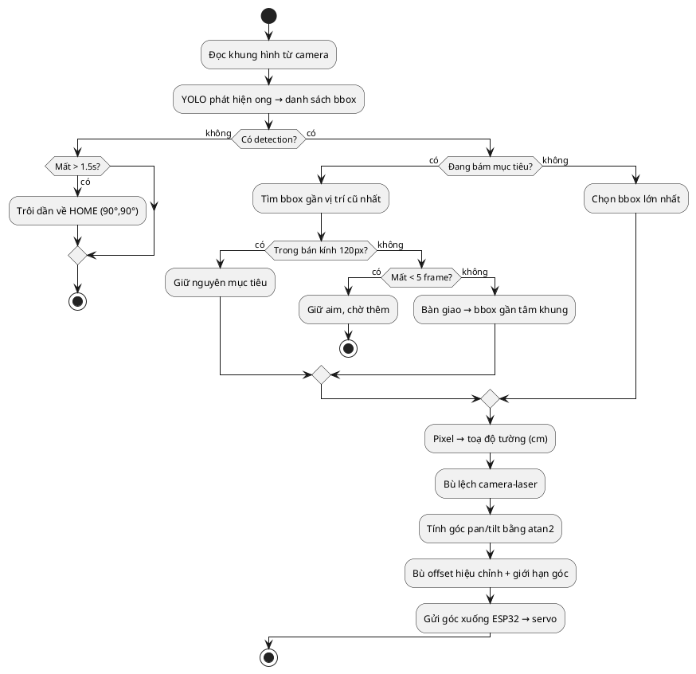

# Báo cáo Hệ thống Tracking — BeeGuard Jetson

> Tài liệu mô tả cơ chế bám mục tiêu (con ong/ong bắp cày) của tháp pháo laser 2 bậc tự do.
> Nguồn: `tracking_engine.py`, `servo_controller.py`, `detection_engine.py`.

---

## 1. Tổng quan & tên gọi

Hệ thống **không** dùng thuật toán tracking deep-learning (SORT / DeepSORT / Kalman filter).
Bản chất là sự kết hợp của 2 lớp:

| Lớp | Tên kỹ thuật | Vai trò |
|---|---|---|
| **Nhắm mục tiêu** | Geometry-based open-loop aiming (nhắm hở dựa hình học) | Đổi toạ độ pixel → góc servo bằng lượng giác |
| **Bám mục tiêu** | Proximity-based target persistence + auto-handoff | Quyết định bám con nào, chống nhảy/mất bám |

Cơ cấu chấp hành: **tháp pháo laser 2-DOF (pan–tilt)** điều khiển bằng 2 servo MG996R qua ESP32.

```
[Camera] → YOLO detect → [tracking_engine] → góc pan/tilt → [ESP32] → 2 servo → laser
```

### Thuật toán bám mục tiêu

Hệ thống sử dụng thuật toán **bám mục tiêu hình học vòng hở** (*open-loop position-based visual servoing*) kết hợp **gán dữ liệu theo láng giềng gần nhất** (*nearest-neighbor track-by-detection*), không dùng Kalman filter hay SORT/DeepSORT vì chỉ bám một mục tiêu tại một thời điểm.

Mỗi khung hình, mô hình YOLO phát hiện các con ong; bộ chọn mục tiêu ghép con gần nhất với vị trí cũ (trong bán kính 120 px) để duy trì bám liên tục, chịu được che khuất ngắn (~0,17 s) và tự bàn giao sang mục tiêu khác khi mất hẳn. Toạ độ pixel của mục tiêu được quy đổi sang toạ độ thực trên tường (cm), bù độ lệch camera–laser, rồi tính góc hai servo pan/tilt bằng lượng giác (`atan2`) — laser nhắm trực tiếp theo góc tính được, không cần vòng phản hồi. Khi mất mục tiêu quá 1,5 s, tháp pháo tự trôi về vị trí home (90°/90°).



---

## 2. Thông số hình học (phần cứng)

Khai báo trong `TrackingEngine` (`tracking_engine.py`):

| Hằng số | Giá trị | Ý nghĩa |
|---|---|---|
| `WALL_FOV_WIDTH` | 82.0 cm | Bề rộng vùng camera nhìn thấy trên tường |
| `WALL_FOV_HEIGHT` | 33.0 cm | Chiều cao vùng nhìn trên tường |
| `DIST_TO_WALL` | 70.0 cm | Khoảng cách từ cụm camera/laser tới tường |
| `CAM_HEIGHT` | 16.0 cm | Độ cao ống kính camera so với mặt đất |
| `LASER_HEIGHT` | 16.0 cm | Độ cao đầu laser (ở vị trí home) |
| `CAM_LASER_H_OFFSET` | 11.0 cm | Khoảng lệch ngang camera ↔ laser (camera bên trái) |
| `CAM_LASER_V_OFFSET` | 0.0 cm | Lệch dọc camera ↔ laser (cùng độ cao) |

**Góc HOME (laser vuông góc tường):**

| Servo | GPIO | HOME | Giới hạn |
|---|---|---|---|
| Pan (vai) | D26 | **90°** | 30°–160° |
| Tilt (khuỷu) | D25 | **90°** | 60°–170° |

> Lưu ý: góc home **thật** do firmware ESP32 quyết định khi nhận lệnh `HOME`. Python chỉ giữ trạng thái nội bộ. Cần đảm bảo firmware cũng đặt 90/90.

---

## 3. Luồng xử lý mỗi frame — `update()`

Chia làm 6 bước:

**Bước 1 — Pixel → toạ độ trên tường (cm)** · `pixel_to_wall_cm()`
Chuẩn hoá pixel về [-0.5, +0.5] rồi nhân kích thước FOV:
```
nx = px/frame_w - 0.5            # +: phải
wx = nx * WALL_FOV_WIDTH         # cm
wy = ny * WALL_FOV_HEIGHT        # cm (+: xuống dưới)
```

**Bước 2 — Toạ độ tường → toạ độ so với gốc laser (cm)** · `wall_to_laser_target()`
Bù trừ độ lệch camera–laser (camera lệch trái laser 11 cm):
```
tx = wx - CAM_LASER_H_OFFSET
ty = -CAM_LASER_V_OFFSET - wy
```

**Bước 3 — Toạ độ → góc servo** · `target_to_desired_angles()`
Dùng lượng giác `atan2`:
```
desired_pan  = PAN_HOME  - degrees(atan2(tx, DIST_TO_WALL))   # PAN_HOME = 90
desired_tilt = TILT_HOME + degrees(atan2(ty, DIST_TO_WALL))   # TILT_HOME = 90
```

**Bước 4 — Bù hiệu chỉnh + giới hạn**
Cộng offset hiệu chỉnh thực địa (`cal_pan_offset=+8°`, `cal_tilt_offset=-8°`, chỉnh được qua app), rồi clamp trong giới hạn servo.

**Bước 5 — Dead-zone + nội suy**
Nếu sai số góc < `dead_zone_deg = 0.3°` → bỏ qua (chống rung). Còn lại tiến về góc đích theo `smooth_factor` (mặc định **1.0 = tức thời**, ưu tiên bám nhanh).

**Bước 6 — Xuất góc** → `servo_controller.send_angles(pan, tilt)`.

---

## 4. Cơ chế bám mục tiêu — `select_target()`

Đây là phần "tracking" cốt lõi: chọn con ong nào để bám trong số nhiều detection. Có 3 trường hợp:

**TH1 — Đang bám 1 mục tiêu:**
Tìm detection gần nhất với vị trí cũ. Nếu trong bán kính `target_match_radius = 120 px` → coi là cùng con, tiếp tục bám.
→ *Chống nhảy lung tung sang con khác.*

**TH2 — Mất tạm thời:**
Chờ `target_lost_patience = 5 frame` (~0.17 s) trước khi từ bỏ; trong lúc đó giữ aim ở vị trí cũ.
→ *Chống mất bám khi ong bị che chốc lát.*

**TH3 — Mất hẳn → tự bàn giao (auto-handoff):**
Chọn detection gần tâm khung hình (điểm laser đang nhắm) nhất.
Nếu **chưa từng có** mục tiêu → chọn **con to nhất** (gần camera nhất).

---

## 5. Khi mất mục tiêu — `_handle_target_lost()`

Sau `max_loss_frames = 45` frame (~1.5 s) không thấy ong:
laser **trôi chậm về home** (90°/90°) với tốc độ `home_speed = 0.03°/frame` — về từ tốn, không giật.

---

## 6. Đặc điểm & lưu ý kỹ thuật

- **Open-loop (vòng hở):** hệ tin tưởng mô hình hình học cố định (khoảng cách tường, FOV). Nếu lắp đặt thay đổi khoảng cách/độ cao thật → phải chỉnh `DIST_TO_WALL`, `WALL_FOV_*`, hoặc dùng `cal_*_offset` để bù. **Không có phản hồi vị trí thật** từ servo.
- **Không dùng PID:** lớp `PIDController` từng tồn tại nhưng đã được dọn bỏ — vì tính được góc đích chính xác từ hình học nên nội suy trực tiếp ổn định hơn, không cần vòng phản hồi.
- **Góc home thật nằm ở firmware ESP32**, không phải Python — cần đồng bộ firmware về 90/90.

---

## 7. Tham số có thể tinh chỉnh

| Tham số | Mặc định | Tác dụng |
|---|---|---|
| `smooth_factor` | 1.0 | 0.1 = mượt/chậm, 1.0 = tức thời |
| `dead_zone_deg` | 0.3° | Ngưỡng bỏ qua rung nhỏ |
| `target_match_radius` | 120 px | Bán kính coi là cùng mục tiêu |
| `target_lost_patience` | 5 frame | Chờ trước khi bỏ mục tiêu |
| `max_loss_frames` | 45 frame | Chờ trước khi trôi về home |
| `cal_pan_offset` / `cal_tilt_offset` | +8° / -8° | Hiệu chỉnh thực địa (qua app) |

---

*Báo cáo sinh từ mã nguồn `D:\beeguard_jetson` — cập nhật theo phiên bản home 90°/90°.*
